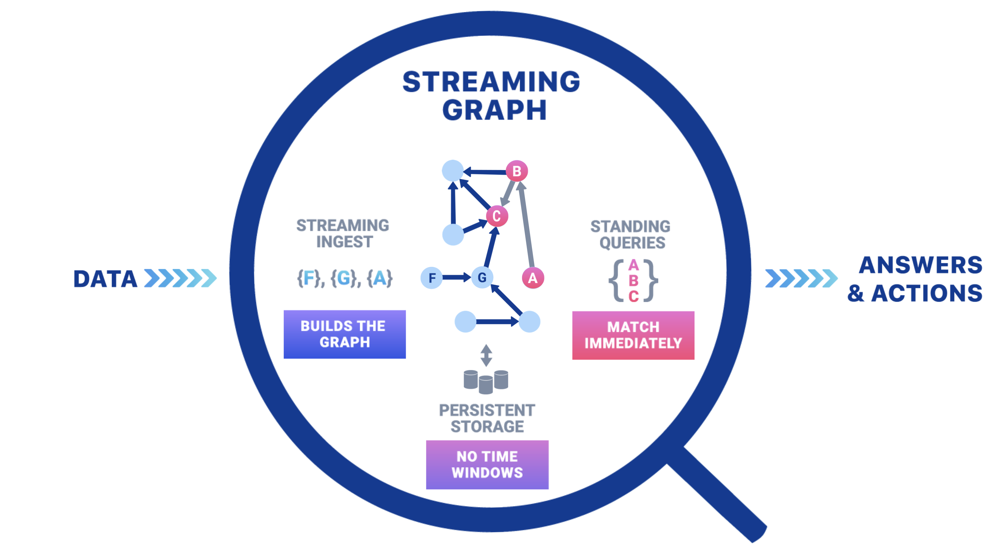

# Architecture

## System Components

### Ingest: Event-Driven Data

Data enters Quine primarily through streaming data sources like Kafka, Kineses, or even POSIX named pipes. These data sources are effectively infinite—Quine works with them as if they will never end. Other types of data sources as supported as well, like ordinary files in CSV, JSON, or other formats.

Each ingest stream has four primary steps:

1. **Consume a stream of bytes** - e.g. Open local file on disk, or connect to a Kafka topic.
2. **Delimit into a sequence of finite byte arrays** - e.g. Use newlines to separate individual lines from a file. Kafka provides delimiting records by its design.
3. **Parse byte array into an object** - e.g. Parse as a string into JSON, or use a provided @link:[protobuf](https://developers.google.com/protocol-buffers){ open=new } schema to deserialize each object.
4. **Ingest query constructs the graph** - e.g. Provide the parsed object as `$that` to a user-defined Cypher query which creates any graph structure desired.

When a new data ingest is configured, Quine will connect to the source and follow the steps described above to use the incoming data stream to build the internal graph. Not all ingest configurations require distinct choices for each step. For instance, a file ingest can define its source as a CSV (Comma Separated Values) file, and the line-delimiting and field parsing are done automatically.

Each ingest stream is backpressured. When Quine is busy with intensive tasks downstream, or possibly waiting for the durable storage to finish processing, Quine will slow down the ingest stream so that it does not overwhelm other components. Backpressured ingest streams ensure maximum throughput while preserving stability of the overall system.

### Asynchronous Graph: Efficient Incremental Computation

The centerpiece of Quine is the graph used to represent the internal data structure and perform computation on it. Quine's unique design combines the graph data model of a property graph with a graph computational model implemented with actors. Each node is backed by actors as needed, allowing the node to send and receive messages, and to perform arbitrary computation to handle them.

Actors representing nodes are managed automatically by Quine. They are loaded on-demand and reclaimed when no longer needed. When live, an actor represents the state of a node at a particular moment in time. That moment might be the thoroughgoing present moment representing the continually changing graph, or it could be a historical moment with the node participating in resolving a historical query.

Historical queries allow Quine to very easily answer queries about what the data -used to be- at any moment in the past. For the user, this is simple a matter of including a timestamp in their query. Under the hood, node actors in Quine implement an event-sourcing strategy where changes to any node are saved as small deltas to the durable storage layer. When needed, these deltas are replayed in order to restore a node to its state at any moment in history.

### Durable Storage: All Data, No Time Windows

Quine saves data to disk using one or more "persistor." A @link:[persistor](https://english.stackexchange.com/a/206980/120983){ open=new } is the interface from the live graph to the underlying durable data storage. As nodes compute which changes need to be saved, those deltas are delivered to the persistor to save to disk. When a node is needed to participate in a query or other computation, its log of changes is loaded from disk and delivered to the node to replay itself up to the relevant moment.

The fundamental data structure provided by the persistor is essentially a key-value store. Quine supports many types of data storage, but they divide broadly into two categories: local vs. remote persistors. Local persistors save data on the same machine on which the Quine graph is running. Remote persistors save data on an external system across a network. Quine's default persistor is a local RocksDB persistor. Production deployments typically use a remote persistor like Cassandra to achieve high availability, data redundancy, and failover strategies.

### Standing Query Output: Data-Driven Events

Standing queries live in the graph and propagate efficiently and automatically. They match any pattern you can describe in a Cypher query. When a standing query completes a new result, it collects any desired data and streams out to the next step immediately.

The next step for standing query outputs can be many kinds of operations:

- Print to the console or stdout
- Publish records to a queue or streaming system like Kafka
- Make calls back in to the graph to fetch additional data
- Make calls back in to the graph to update other values or execute any query (very powerful!)

Standing queries can be used for a huge number of purposes. A few examples:

- stream results out to the next system in a data pipeline
- produce a dataset of cleaned-up data to feed machine learning pipelines
- maintain indices
- produce alerts for misconfigured systems
- detect patterns of suspicious activity

<!-- TODO
## Code Components

( Diagram like what I drew for Ethan in the library )

### GraphService

### Quine App

### Persistor

### GraphShard

### Node Actor

-->
