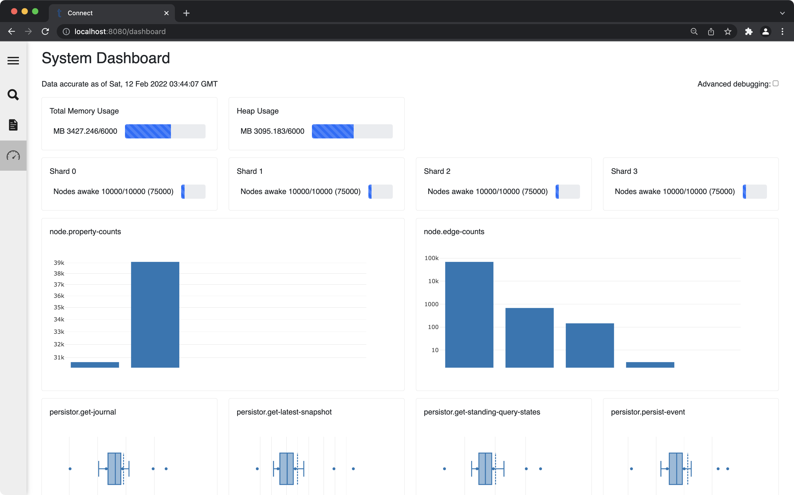

# Operational Considerations

## Deploying: Basic Resource Planning

Quine is extremely flexible in its deployment model. It is robust and powerful enough to run on a server with hundreds of CPU cores and terabytes of RAM, but also small and lightweight enough to run on a Raspberry Pi.

Quine is a backpressured system; it will deliberately slow down when resource-constrained. This is a highly desirable quality because the only alternative is to crash the system. Making Quine run faster is essentially a matter of allocating resources to the machine/environment so that the slowest component is not a bottleneck.

### CPU

As a distributed system, Quine is designed from the ground up to take advantage of multiple CPU cores. Quine will automatically configure increased parallelism where there are more CPU cores available. This configuration can be customized using the Akka configuration settings for the `default-dispatcher` when starting up Quine.

### RAM

System memory (RAM) is used by Quine primarily to keep nodes in the graph warm in the cache. When a node required for a query or operation is needed, if it is live in the cache, then calls to disk can often be entirely avoided. This significantly increases performance and throughput of the system overall. So in general, the more nodes live in the cache, the faster the system will run.

@@@ note
Quine uses a novel caching strategy that we call "semantic caching". The net result is that there is a decreasing benefit to having additional nodes kept in memory. There is only a performance improvement if those nodes are needed.
@@@

Since Quine runs in the JVM, you can have Quine use additional system RAM in the standard Java fashion by increasing the maximum heap size with the `-Xmx` flag when starting the application. E.g.: `java -Xmx6g -jar quine.jar`  In order for Quine to receive a benefit from increased RAM, you will probably also need to increase the limit of nodes kept in memory per shard by changing the `in-memory-soft-node-limit`, and possibly the `in-memory-hard-node-limit` sizes. See the @ref[Configuration Reference](../reference/configuration.md) for details. The ideal setting for these limits depends on the use case and will vary. We suggest monitoring usage with the tools described below to determine the best settings for your application. In-memory node limits can be changed dynamically from the built-in REST API with the `shard-sizes` endpoint.

@@@ warning
Keep in mind that setting the maximum heap size is not the same as limiting the total memory used by the application. Some amount of additional off-heap memory will be used when the system is operating normally. Off-heap memory usage is usually trivial, but can become significant in some cases, e.g.: Lots of network traffic, or using memory mapped files. The latter case can becomes very significant when using the MapDB persistor, which defaults to using memory mapped files for local data storage.
@@@

### Storage

Quine stores data using one or more @ref[Persistor](../components/persistors/persistor.md). Persistors are either local or remote. A local persistor will store data on the same machine where Quine is running, at a location in the filesystem determined by its configuration. A remote persistor will store data on a separate machine. By default, Quine will use the local RocksDB persistor.

For production deployments, we recommend using a remote persistor like @ref[Cassandra](../components/persistors/persistor.md#cassandra) to provide data redundancy and high-availability. Additionally, old data can be expired from disk using Cassandra's time-to-live setting in order to limit the total size of data stored.

## Monitoring

It is often helpful to watch an operating system to confirm it is behaving as anticipated. Quine includes multiple mechanisms for monitoring a running system.

### Web Browser

A basic operational dashboard is built into the pages served from the Quine web browser.

This page includes live updating reports on memory usage, nodes in the cache (per shard), basic histograms of the the number of properties and edges per node, and latency measurements of various important operations.

### REST API

Quine serves a REST API from its built-in web server. That web server provides separate readiness and liveness API endpoints for monitoring the status of the Quine system. Detailed metrics can be retrieved from the endpoint: `GET /api/v1/admin/metrics`

### JMX

Quine can be monitored and controlled live using JMX. There is a wide array of tools available for monitoring JVM applications through JMX. If you don't already have a preference, you might start with @link:[VisualVM](https://visualvm.github.io){ open=new }.

<!--
### InfluxDB
-->

